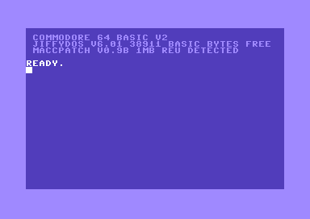
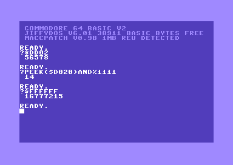

# MaccJiffyDOS

**MaccPatch v0.9b** applied to JiffyDOS 6.01 for the Commodore 64.

This repository does **not** include any JiffyDOS ROM images. You must supply your own legally obtained **JiffyDOS 6.01 KERNAL ROM** and apply the patch.



## Quick start

Patch your JiffyDOS 6.01 ROM (verified by MD5) and produce a patched ROM:

```bash
python3 version0.9B/apply_patch.py jiffydos601.rom version0.9B/maccpatch_v0.9b.bin maccjiffy.rom
```

- The script verifies the MD5 of the input ROM and patch data.
- The output ROM is also MD5-checked.
- The resulting ROM will have a proper `$E0` checksum. (Checksum calculation here: https://github.com/mist64/c64rom/tree/master)

You can then burn an EPROM with `maccjiffy.rom`, or use it as a ROM file in an emulator.

## What this patch changes

### Removed features/code

- KERNAL RS232 code and leftover tape-handling code
- JiffyDOS file copy feature and related code
- JiffyDOS printing features

### Fixes and improvements

- Fixes JiffyDOS `?@` issues
- REU non-destructive REU/size detection at boot
- No memory test at boot
- Removes a memory corruption issue at `$FD27`
- “Nice Restart” (screen off, black, VBL)
- Safe free RAM calculation with cartridge-disabler reset circuit (like in KKF2)
- Default character color: white
- Default key repeat speed increased by 25%

### Compatibility note

All JiffyDOS features not mentioned above should still work.

## New function key definitions

| Key | Sends         | Description                                                |
| --- | ------------- | ---------------------------------------------------------- |
| F1  | `@$:*` + CR   | Directory + ENTER                                          |
| F2  | `@$=P` + CR   | Directory partitions + ENTER                               |
| F3  | `@ "CD:` + CR | Change into directory + ENTER (cursor on a directory line) |
| F4  | `@CD_` + CR   | Change to parent directory + ENTER                         |
| F5  | `^` + CR      | `,DN` load BASIC/run + ENTER (cursor on a directory line)  |
| F6  | `%` + CR      | `,DN,1` load data + ENTER (cursor on a directory line)     |
| F7  | `_2:*` + CR   | Load & run `2:*` + ENTER                                   |
| F8  | `@  "S:`      | Delete file (cursor on a file line)                        |

## BASIC extensions

### Basic-safe hexadecimal/binary/octal numbers

BASIC-safe implementation of hexadecimal, binary and octal number system handling::

- Hex: `$89ABCD`
- Binary: `%10101110`
- Octal: `&4567`

Examples:

`?$FFFF`
`POKE $D020,$C`
`10 FOR I=$400 TO $6E8: POKE I,%100000: NEXT`



### Convenience

- Typing `$` on its own loads the directory
- Shows hexadecimal start/end addresses during Load/Save/Verify
- FUll RAM Load/Save/Verify for JiffyDOS IEC devices
- Run/Stop + Restore: displays the interrupted code PC: `break at $89AB`

## Memory commands

Most of these use the REU. All new memory commands:

- Start with `.`
- Use hexadecimal arguments and outputs (if any)
- Whitespaces are optional (except where noted)

### Viewing

- `.G` — Memory view in HiRes graphic mode (C64 memory restored at exit, REU memory's full first bank used as buffer). First copies all C64 RAM to the REU, then flips through pages. Use CRSR LEFT/RIGHT for next/previous, exit with STOP. Uses the current background/character colors. With this command, you make a quick snapshot of the whole C64 RAM area, as a side effect.
- `.RG` — REU-safe view (shows REU content only; REU memory not modified; C64 memory modified $2000-$4000).
- `.M 1000` - Hexdump from address; continues until STOP

### Load/Save and managing memory

```text
.L "FN" 1000            Load FN from active device to base address (start)
.S "FN" 1000 2000       Save memory region (start, end - end address is exclusive)
.F 1000 0100 AA         Fill C64 memory (start, length, fillbyte)
.RF 0F0000 0200 AA      Fill REU memory (start, length, fillbyte)
.T 1000 0100 2000       Transfer C64 memory (source, length, target - uses REU as buffer)
.RT 0F0000 0100 1000    Transfer REU -> C64
.RT 1000*0100 0F0000    Transfer C64 -> REU (* mandatory space)
```

## Requirements

- Python 3
- A JiffyDOS 6.01 C64 KERNAL ROM image matching the expected MD5

## MD5 checksums

The patch script enforces these checksums:

- JiffyDOS 6.01 input ROM: `be09394f0576cf81fa8bacf634daf9a2`
- Patch data `maccpatch_v0.9b.bin`: `1c76120a56d45648adbe819473d571be`
- Patched output ROM: `a0b33a60e38b6795682319a520b039d9`

If your ROM image differs (different dump/version/format), the patch will intentionally refuse to apply.

## Notes

- The patch leaves “a total of 14 unused bytes in 5 locations”.
- This project is intended for personal use with legally obtained ROMs.
- A few things remaining (future update maybe) like full RAM load for non Jiffy devices, relocate $9F00 buffer, to keep most of the RAM intact after restart.

## Files to download (included in this repo)

These two files are the only things you need from _this_ repository to patch your own JiffyDOS 6.01 ROM:

- [version0.9B/apply_patch.py](version0.9B/apply_patch.py) — Python 3 patcher that verifies MD5 checksums and produces the patched ROM.
- [version0.9B/maccpatch_v0.9b.bin](version0.9B/maccpatch_v0.9b.bin) — The MaccPatch v0.9b binary diff data applied to the JiffyDOS 6.01 ROM.
